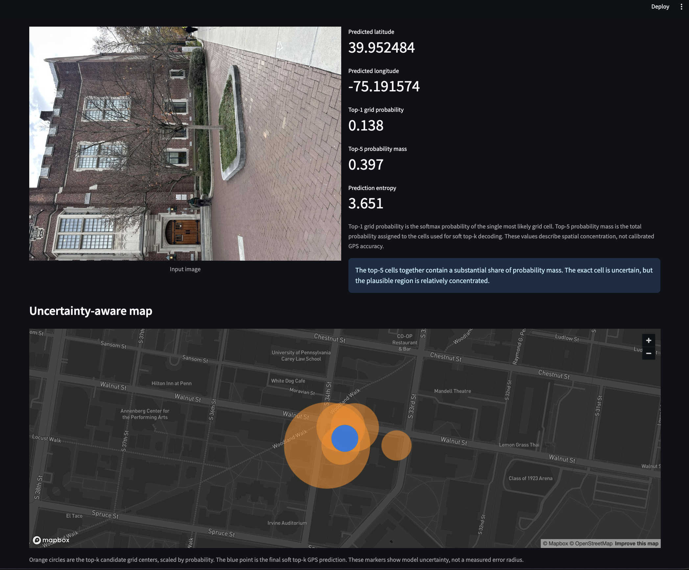

## Campus-Image-Geolocation-using-Deep-Learning


> A computer vision and deep learning project that predicts approximate GPS coordinates from campus images using structured spatial classification and uncertainty-aware top-k decoding.

## Overview

**img2GPS** reframes image geolocation as a structured spatial prediction problem.

Rather than directly regressing latitude and longitude as two continuous values, the target campus region is divided into a **10 × 10 spatial grid**. A deep learning model predicts a probability distribution across grid cells, and the final GPS coordinate is obtained through **soft top-k decoding**.

This approach makes the prediction process more interpretable and better suited to visually similar locations, where multiple nearby regions may appear plausible.

The repository is organized as an end-to-end ML engineering project with support for:

- Model training and evaluation
- Image-based GPS prediction
- Grid-based spatial localization
- Soft top-k coordinate decoding
- Geographic error measurement using Haversine distance
- Uncertainty-aware inference
- Streamlit interactive demo
- FastAPI inference service
- Docker deployment
- Automated tests
- Error analysis utilities

---

## Demo



The Streamlit application provides an interactive inference workflow:

1. Upload an image.
2. Run model inference.
3. Predict latitude and longitude.
4. Visualize the predicted location on a map.
5. Inspect the most likely grid cells.
6. Review uncertainty-related prediction statistics.

The interface displays:

- Predicted GPS coordinate
- Map visualization
- Top-k candidate grid cells
- Top-1 grid probability
- Top-k probability mass
- Prediction entropy

> The candidate grid markers represent plausible model predictions and uncertainty. They should not be interpreted as a measured geographic error radius.

## Project Highlights

- **Computer Vision:** ResNet-50 backbone for visual feature extraction
- **Deep Learning:** Spatial classification over a 10 × 10 grid
- **Geolocation:** Converts image understanding into structured location prediction
- **Soft Top-k Decoding:** Produces probability-weighted GPS coordinates instead of relying only on argmax
- **Evaluation:** Uses Haversine distance for geographic error measurement
- **Uncertainty Awareness:** Exposes top-k probabilities and prediction entropy
- **Interactive Demo:** Streamlit interface for image-based predictions
- **API Deployment:** FastAPI inference endpoint
- **Containerization:** Docker and Docker Compose support
- **Reproducibility:** Configuration-driven training and testing workflow
- **Privacy Consciousness:** Raw datasets, GPS records, checkpoints, and private artifacts remain outside the repository

---

## Methodology

### 1. Input Image

A campus image is provided as the model input.

### 2. Image Preprocessing

Images are transformed and normalized before being passed to the neural network.

### 3. Visual Feature Extraction

A **ResNet-50** backbone extracts high-level visual representations from the image.

### 4. Grid-Based Spatial Classification

The campus region is divided into **100 grid cells**.

The model predicts a probability distribution:


Input Image
     ↓
Image Preprocessing
     ↓
ResNet-50 Backbone
     ↓
100-Cell Spatial Classification
     ↓
Top-k Candidate Cells
     ↓
Soft Probability-Weighted Decoding
     ↓
Predicted Latitude & Longitude
```

### 5. Soft Top-k GPS Decoding

Instead of selecting only the most probable cell using hard argmax, inference considers multiple high-probability candidate cells.

The final coordinate is computed using a probability-weighted combination of the top-k candidate grid centers.

This can reduce instability when visually similar locations produce uncertainty across nearby spatial regions.

---

## Why Grid-Based Localization?

Direct coordinate regression treats latitude and longitude as independent continuous outputs.

For campus-scale image geolocation, this can make learning difficult because geographically nearby locations may contain visually similar buildings, paths, vegetation, or architectural features.

Grid-based localization introduces spatial structure:

- The model first identifies a likely geographic region.
- Predictions become easier to interpret.
- Multiple plausible regions can be examined.
- Top-k probabilities provide insight into model uncertainty.
- Coordinates can be decoded from candidate spatial regions.


## Tech Stack

| Category | Technologies |
|---|---|
| Language | Python |
| Deep Learning | PyTorch |
| Computer Vision | ResNet-50 |
| Data | Hugging Face Datasets |
| Web Demo | Streamlit |
| API | FastAPI |
| Deployment | Docker, Docker Compose |
| Testing | Pytest |
| Evaluation | Haversine Distance |

---

## Repository Structure

```text
img2gps/
├── app/
│   └── streamlit_app.py
├── api/
│   └── main.py
├── assets/
│   └── demo_streamlit.png
├── configs/
│   └── default.yaml
├── examples/
│   └── images/
│       ├── example_01.jpg
│       ├── example_02.jpg
│       └── README.md
├── scripts/
│   ├── analyze_errors.py
│   └── plot_grid_distribution.py
├── src/
│   └── img2gps/
│       ├── __init__.py
│       ├── config.py
│       ├── data.py
│       ├── evaluate.py
│       ├── inference.py
│       ├── metrics.py
│       ├── model.py
│       ├── predict.py
│       └── train.py
├── tests/
├── checkpoints/
│   └── README.md
├── README.md
├── requirements.txt
├── pyproject.toml
├── Dockerfile
├── docker-compose.yml
└── .gitignore
```

---

## Getting Started

### 1. Create a Python Environment

```bash
conda create -n img2gps python=3.11 -y
conda activate img2gps
```

### 2. Install Dependencies

```bash
pip install -r requirements.txt
pip install -e .
```

### 3. Run Tests

```bash
pytest -q
```

---

## Dataset

The dataset is hosted externally on Hugging Face:

```text
yyss114/CIS-5190-project-6
```

Dataset page:

```text
https://huggingface.co/datasets/yyss114/CIS-5190-project-6
```

The expected dataset fields include:

```text
image
latitude
longitude
source
```

The full dataset is intentionally not stored in this repository.

Only small anonymized example images are included for testing and demonstration.

```text
examples/images/
```

---

## Training

Train the model using the default configuration:

```bash
python -m img2gps.train --config configs/default.yaml
```

The training pipeline supports:

- Hugging Face dataset loading
- Image augmentation
- 10 × 10 grid-label construction
- Location-aware validation splitting
- Model checkpoint saving
- Geographic evaluation using Haversine distance

Training outputs are generated under:

```text
outputs/
```

Generated training artifacts are excluded from version control.

---

## Checkpoints

The trained model checkpoint is not committed to the repository.

Expected local path:

```text
checkpoints/best.pt
```

Example:

```bash
mkdir -p checkpoints
cp /path/to/model.pt checkpoints/best.pt
```

Large model artifacts should remain outside GitHub repositories or be stored using an appropriate model storage solution.

---

## Prediction

Run inference on an example image:

```bash
python -m img2gps.predict \
  --checkpoint checkpoints/best.pt \
  --image examples/images/example_01.jpg
```

The prediction workflow returns an estimated geographic coordinate based on the model's grid probabilities and top-k decoding strategy.

---

## Streamlit Demo

Launch the interactive application:

```bash
streamlit run app/streamlit_app.py
```

The demo enables users to:

- Upload a campus image
- Generate a GPS prediction
- View the predicted location on a map
- Inspect top-k candidate grid cells
- Review probability statistics
- Examine prediction entropy

---

## FastAPI Inference Service

Start the API server:

```bash
uvicorn api.main:app --reload --host 0.0.0.0 --port 8000
```

### Example Request

```bash
curl -X POST "http://localhost:8000/predict?top_k=5" \
  -F "file=@examples/images/example_01.jpg"
```

### Example Response

```json
{
  "latitude": 39.9520,
  "longitude": -75.1930,
  "confidence": 0.0863,
  "entropy": 3.42,
  "top_k_cells": [
    {
      "cell_id": 73,
      "probability": 0.0863,
      "latitude": 39.9519,
      "longitude": -75.1932
    }
  ]
}
```

> `confidence` represents the top-1 grid probability. It should not be interpreted as a calibrated measure of geographic accuracy.

---

## Docker

### Build the Image

```bash
docker build -t img2gps .
```

### Run the FastAPI Service

```bash
docker run -p 8000:8000 \
  -v $(pwd)/checkpoints:/app/checkpoints:ro \
  img2gps
```

### Docker Compose

```bash
docker compose up --build
```

---

## Evaluation

Evaluate a trained model:

```bash
python -m img2gps.evaluate \
  --checkpoint checkpoints/best.pt \
  --csv reference/metadata.csv \
  --image-dir reference/images \
  --predictions-out outputs/predictions.csv
```

### Primary Metric

The primary geographic evaluation metric is **Haversine distance**, measured in meters.

This directly measures the geographic distance between predicted and ground-truth coordinates.

---

## Error Analysis

After generating prediction results, run:

```bash
python scripts/analyze_errors.py \
  --predictions outputs/predictions.csv \
  --out-dir outputs/error_analysis
```

The analysis workflow can generate:

```text
error_histogram.png
grid_error_heatmap.png
worst_20_predictions.csv
summary.json
```

Error analysis is important because low training loss does not necessarily correspond to low geographic error.

For this task, Haversine distance provides a more meaningful measure of real-world prediction quality.

---

## Understanding Prediction Uncertainty

The model produces probabilities across **100 spatial grid cells**.

### Top-1 Grid Probability

The probability assigned to the most likely grid cell.

A high value indicates that the model distribution is concentrated, but it does **not** guarantee accurate GPS prediction.

### Top-k Probability Mass

The combined probability assigned to the highest-ranked candidate cells.

This can provide additional context when multiple nearby locations are plausible.

### Prediction Entropy

Entropy measures how spread out the predicted probability distribution is.

- Lower entropy generally indicates a more concentrated prediction distribution.
- Higher entropy indicates greater uncertainty across candidate regions.

> These statistics are useful for interpreting model behavior but are not substitutes for evaluation against ground-truth GPS coordinates.

---

## Privacy and Data Policy

This repository does **not** include:

- Full image datasets
- Raw GPS records
- Model checkpoints
- Private reports
- API keys
- Credentials

Before adding new demonstration images:

- Remove EXIF metadata.
- Avoid clear faces.
- Avoid visible license plates.
- Avoid private or sensitive spaces.
- Ensure images are appropriate for public demonstration.

---

## Limitations

This model is designed for a **fixed campus-scale geographic region**.

It should not be expected to generalize directly to:

- Other campuses
- Cities
- Countries
- Unseen geographic regions

without additional training data and retraining.

Other limitations include:

- Visually similar locations may create ambiguous predictions.
- GPS labels may contain noise.
- Grid boundaries can introduce discretization errors.
- Top-k probability is not equivalent to calibrated location confidence.
- Performance should be evaluated against ground-truth GPS coordinates.

---

## Future Improvements

Potential directions for future development include:

- Calibrated uncertainty estimation
- Incorporating an offset regression head into final decoding
- Improved map visualization for candidate regions
- Lightweight web deployment
- Comparing grid classification with direct coordinate regression
- Exploring retrieval-based geolocation methods
- Expanding to more geographically diverse campus regions
- Adding model cards and dataset cards
- Improving experiment tracking and reproducibility

---

## Skills Demonstrated

This project demonstrates practical experience with:

- Python
- PyTorch
- Deep Learning
- Computer Vision
- Transfer Learning
- ResNet Architectures
- Spatial Classification
- Machine Learning Evaluation
- Haversine Distance
- Uncertainty Interpretation
- FastAPI
- Streamlit
- Docker
- REST API Development
- Model Deployment
- Testing and Reproducible ML Workflows

---

## License

This repository is intended for **educational and portfolio purposes**.

See the `LICENSE` file for details.
